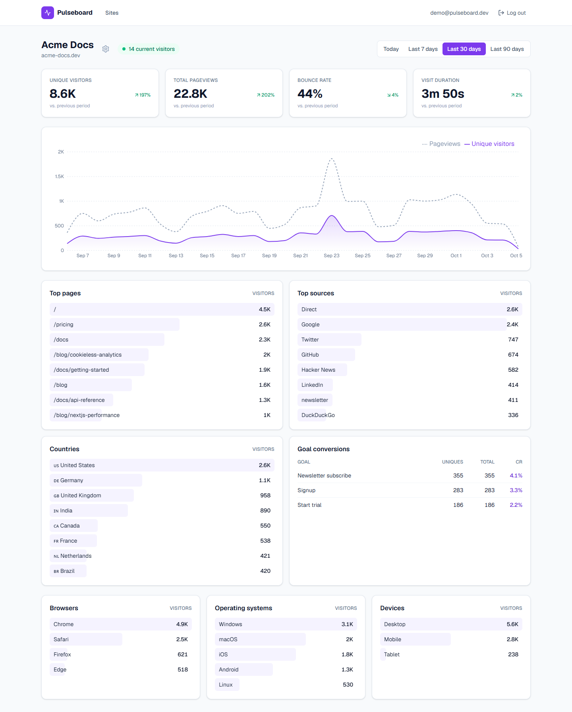
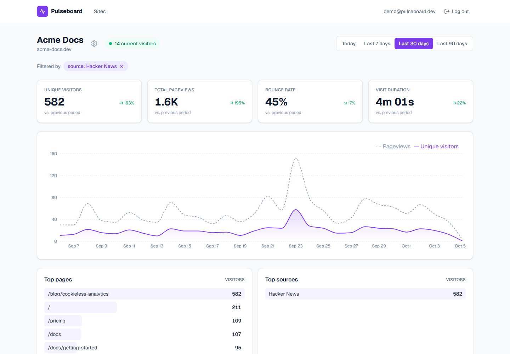
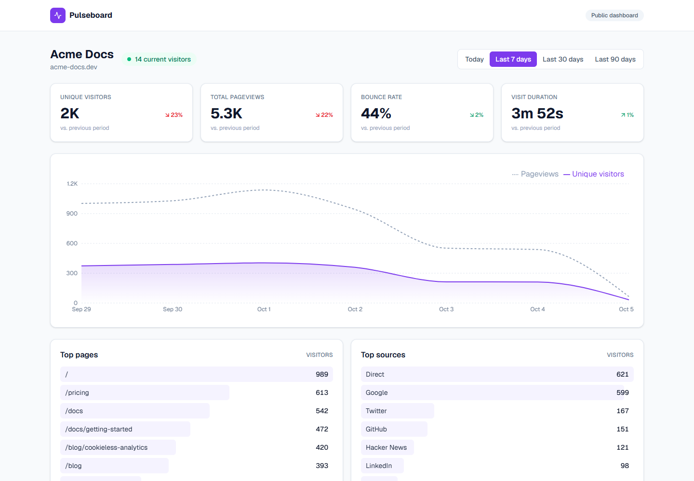
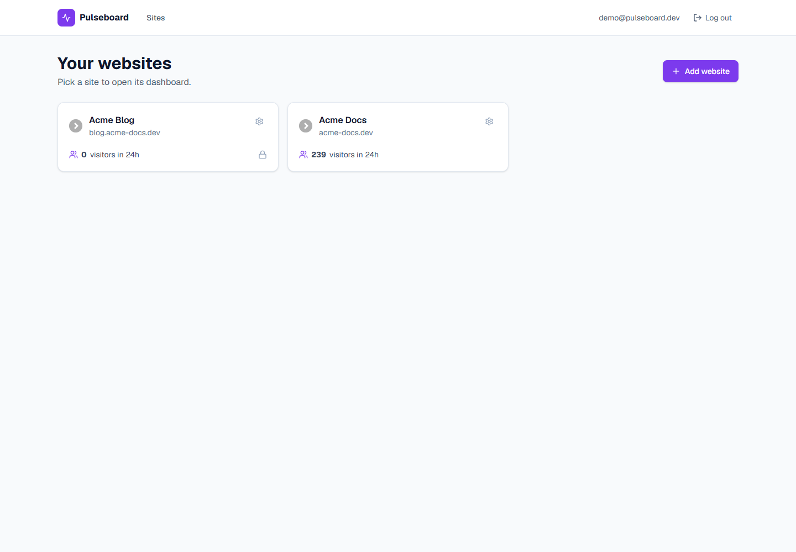
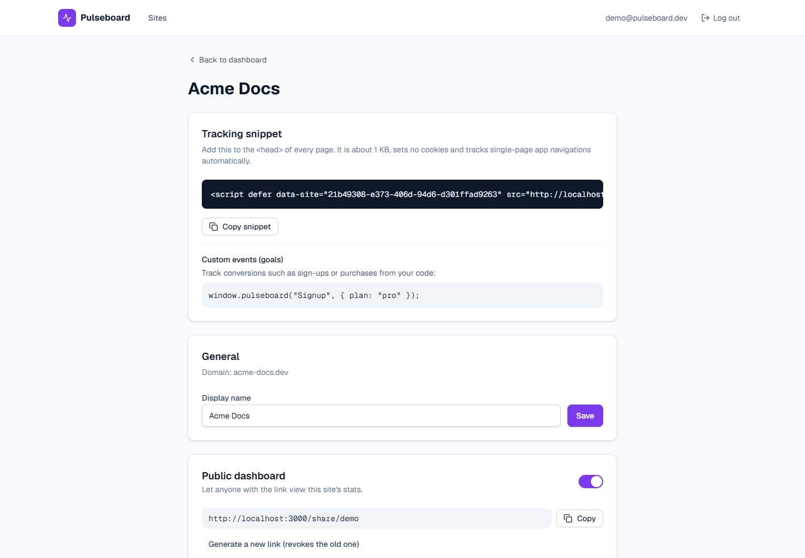
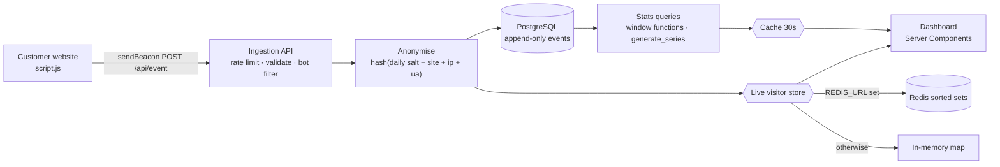

# Pulseboard — Privacy-Friendly Web Analytics

[](https://github.com/ebrahimmorkas/pulseboard-analytics/actions/workflows/ci.yml)


Pulseboard is a self-hostable, cookie-free web analytics platform in the spirit of Plausible: add one script tag to a website and get a clear, real-time dashboard — without collecting personal data.

It covers the whole pipeline: a ~1 KB **tracking script**, a rate-limited **ingestion API**, anonymised storage in PostgreSQL, and a **dashboard** whose metrics (sessions, bounce rate, visit duration) are computed in SQL with window functions. **Redis is optional**: it adds shared caching, rate limits and live-visitor counts across instances, and the app falls back to in-memory implementations without it.



## Features

- **One-line install** — `<script defer data-site="…" src="…/script.js">`; tracks SPA navigations and custom events (`window.pulseboard("Signup")`)
- **Privacy by design** — no cookies, no stored IP addresses, daily-rotating anonymous visitor IDs, query strings never stored
- **Dashboard** — unique visitors, pageviews, bounce rate, visit duration with period-over-period comparison; hourly/daily chart; top pages, sources, countries, browsers, OS and devices; goal conversions
- **Click-to-filter** — click any page, source or country to filter the whole dashboard; state lives in the URL
- **Real-time** — current visitors (last 5 minutes), updated every 10 seconds
- **Public dashboards** — share a read-only link, revoke it any time
- **Multi-site** — manage any number of websites per account
- **Data quality** — bot filtering and per-domain validation so nobody else can pollute your stats

## Screenshots

| Filtered by source                         | Public share page                                      |
| ------------------------------------------ | ------------------------------------------------------ |
|  |  |
| **Sites**                                  | **Tracking snippet & settings**                        |
|        |              |

## Tech stack

| Area                                | Technology                                                                             |
| ----------------------------------- | -------------------------------------------------------------------------------------- |
| Framework                           | Next.js 16 (App Router, Server Components, Server Actions, Route Handlers, `proxy.ts`) |
| UI                                  | React 19, Tailwind CSS 4, Recharts, Lucide icons                                       |
| Data                                | PostgreSQL 17, Drizzle ORM, SQL migrations                                             |
| Caching / rate limits / live counts | Redis (ioredis) **or** in-memory, with automatic fallback                              |
| Validation                          | Zod 4                                                                                  |
| Testing                             | Vitest unit tests + integration tests against PostgreSQL and Redis                     |
| Tooling                             | ESLint, Prettier, GitHub Actions, Docker                                               |

## How it works



### Design decisions

- **Cookieless visitor IDs.** `visitor_id = sha256(dailySalt + siteId + ip + userAgent)`, truncated to 64 bits. The salt is an HMAC of the UTC date, so IDs rotate every day and differ per site: unique visitors can be counted, but nobody can be followed across days or websites. The raw IP and user agent are never written to disk.
- **Sessions computed in SQL.** `LAG()` finds the gap to each visitor's previous pageview, a gap over 30 minutes starts a new session, and a running `SUM()` numbers the sessions. Bounce rate and visit duration come from grouping by (visitor, session). An integration test checks the result against a hand-calculated dataset.
- **Gap-free charts.** Time series are joined against `generate_series`, so hours or days without traffic still appear as zero.
- **Indexes for the two hot paths.** `(site_id, created_at)` for time-range aggregation and `(site_id, visitor_id, created_at)` for sessionisation.
- **Optional Redis, three uses.** Dashboard queries are cached for 30 s; ingestion is rate limited per IP; current visitors live in a sorted set per site (`ZADD` / `ZREMRANGEBYSCORE` / `ZCOUNT`). Each has an in-memory equivalent, and Redis failures fall back to it automatically.
- **Trustworthy data.** Events are only accepted from the site's registered domain or its subdomains, bots and scripts are dropped, and the endpoint always answers `202` so senders learn nothing.
- **Shareable state.** Period and filters are URL parameters and the dashboard is a Server Component, so every view can be bookmarked, shared, and rendered without client-side data fetching.

## Getting started

### Prerequisites

- Node.js 20.9+ (22 recommended)
- Docker (for PostgreSQL and, optionally, Redis)

### Setup

```bash
git clone https://github.com/ebrahimmorkas/pulseboard-analytics.git
cd pulseboard-analytics
npm install

cp .env.example .env          # defaults match docker compose
docker compose up -d          # PostgreSQL on port 5434
npm run db:migrate
npm run db:seed               # demo account + ~31k events over 45 days
npm run dev                   # http://localhost:3000
```

Log in with **`demo@pulseboard.dev`** / **`Password123`**, or open the public demo at `/share/demo`.

### Track your own site

1. Add a website under **Sites → Add website**
2. Paste the snippet from the site's settings page into your `<head>`
3. Optionally track goals: `window.pulseboard("Signup")`

In development, events from `localhost` are accepted for any site so you can test locally.

### Optional: Redis

```bash
docker compose --profile redis up -d     # Redis on port 6381
# .env
REDIS_URL=redis://localhost:6381
```

`GET /api/health` reports which cache and live-visitor drivers are active.

## Scripts

| Script                                                         | Description                                                             |
| -------------------------------------------------------------- | ----------------------------------------------------------------------- |
| `npm run dev`                                                  | Start the development server                                            |
| `npm run build` / `npm start`                                  | Production build / server                                               |
| `npm run lint` · `npm run typecheck` · `npm run format`        | Code quality                                                            |
| `npm test`                                                     | Unit tests                                                              |
| `npm run test:integration`                                     | Integration tests (PostgreSQL; Redis tests run when `REDIS_URL` is set) |
| `npm run db:generate` / `db:migrate` / `db:seed` / `db:studio` | Database workflow                                                       |

## Testing

- **Unit tests** — user agent parsing, bot detection, source resolution, visitor IDs, payload validation, domain normalisation, period boundaries, URL state, cache stores, rate limiter, live-visitor store, auth helpers and proxy redirects.
- **Integration tests** — ingestion (enrichment, anonymisation, rejected events), the statistics queries against a known dataset, and the Redis live-visitor store.
- **CI** — lint, typecheck, unit tests and production build, plus migrations and integration tests against PostgreSQL and Redis service containers.

## Project structure

```
src/
├── app/
│   ├── (auth)/                  # Login and sign-up
│   ├── (app)/sites/             # Site list, dashboard, settings
│   ├── share/[slug]/            # Public read-only dashboards
│   ├── script.js/               # The tracking script
│   └── api/                     # event ingestion, live visitors, health
├── components/dashboard/        # Dashboard, chart, breakdown cards, live indicator
├── db/                          # Drizzle schema and client
└── lib/
    ├── tracking/                # UA parser, sources, visitor ids, ingestion
    ├── stats/                   # Periods and filters
    ├── queries/                 # SQL statistics and site queries
    ├── live/                    # Live visitors (Redis sorted sets or memory)
    ├── cache/                   # Redis / memory / fallback stores
    └── auth/                    # Passwords, sessions, guards
drizzle/                         # SQL migrations
scripts/seed.ts                  # Synthetic demo traffic
```

## Deployment

```bash
docker build -t pulseboard .
docker run -p 3000:3000 --env-file .env pulseboard
```

Run `npm run db:migrate` during release and set a strong `ANALYTICS_SALT_SECRET`. Behind a proxy or CDN, make sure `X-Forwarded-For` is forwarded; country data is read from `x-vercel-ip-country` or `cf-ipcountry` when present.

## License

[MIT](LICENSE)
